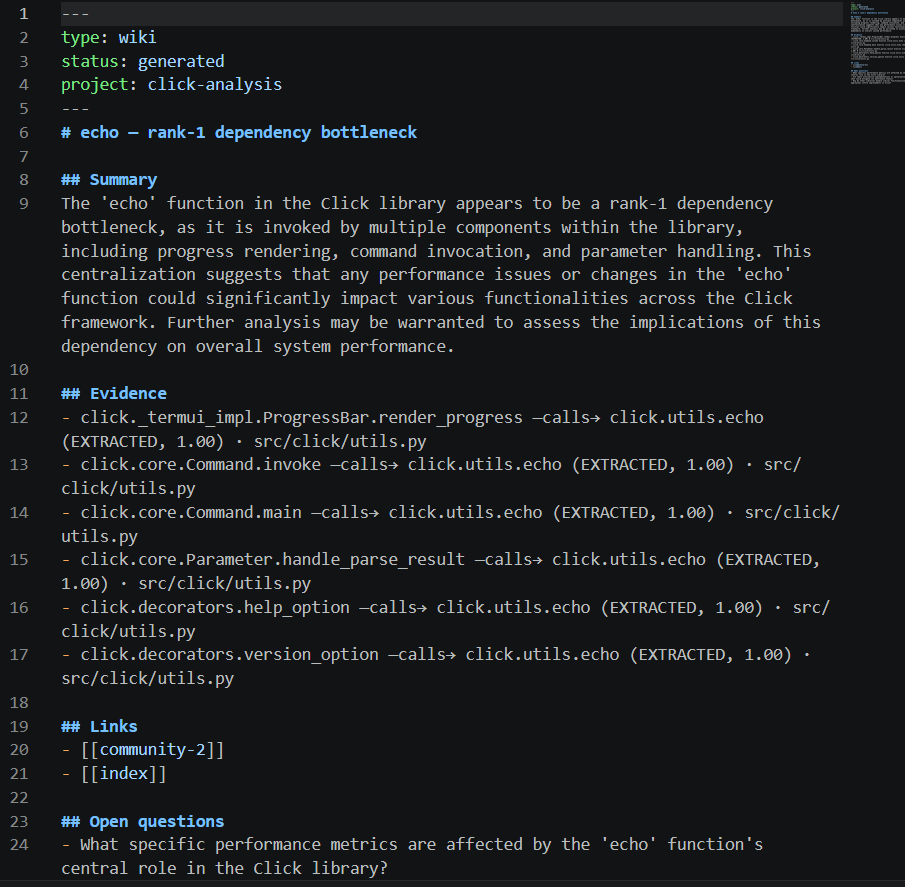
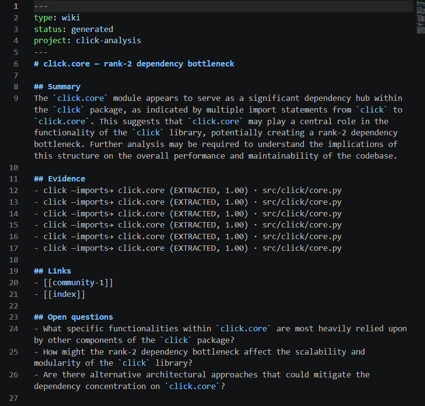

# HW4 — EX04: Graph-Based Reverse Engineering with AI Agents

Reverse-engineers an unfamiliar Python repository through a knowledge
graph (AST extractor with a Graphify-compatible contract), navigates it
as an Obsidian vault + LLM wiki, detects **architectural** defects
(SPOF, god modules, isolation, traceability gaps) with evidence-chained
findings, fixes them in a **test-guarded improvement loop**, and
measures the **token savings** of graph-guided retrieval vs naive
context stuffing in a frozen A/B experiment.

> Course: Lecture 07 — Reverse Engineering of Graph Knowledge Systems
> (Dr. Yoram Segal, June 2026). Governing docs: `docs/PRD.md`,
> `docs/PLAN.md`, `docs/TODO.md` (515 tasks), 6 dedicated mechanism PRDs.

## Status at a glance

| Axis | State |
|---|---|
| Target | **`pallets/werkzeug@1b00618e`** — the WSGI toolkit under Flask, **16,829 source LOC / 52 files** (27,498 across 138 `.py` incl. its own tests), BSD-3, 992-test suite in ~60 s. Chosen + provenance in `docs/TARGET_REPO.md` |
| Engineering | ~350 tests green · coverage ≈96% (gate 85%) · ruff 0 · all files ≤150 code lines · `scripts/check_gates.py` GREEN |
| Analysis | graphed into **1,912 nodes / 3,304 edges**, **2 source-validated defects** (`results/FINDINGS.md`) |
| Token experiment (LIVE) | **58.7% input-token savings** (median 60.2%) — **below the 70% target**, with an honest failure analysis: Condition B is already lean (~6.5k tok/cell, not over-provisioned), so the gap is bounded by the naive 16k cap, not fixable without risking correctness (`docs/PRD_token_experiment.md`). Correctness/citation KPI pending human blind scoring |
| Fix loop (LIVE) | **honest NO_SAFE_ACTION** on the `http` god-node: the LLM's helper-extraction kept all 992 target tests green but produced no structural gain, so the graph-diff guard reverted it (`results/FINDINGS.md` §8, `results/dashboard.md`) |
| Vault & agents (LIVE) | 44 LLM wiki pages (5 hubs + 39 communities); crew narratives with findings identical to the direct path |
| Cost | **$0.08** of the $10 budget firewall, 89 gated calls (this werkzeug run; the retired click run's ledger is preserved in git history), all ledgered (provider: OpenAI gpt-4o-mini, config-switched — ADR-3 swappability proven live) |

## Installation

Prerequisites: `git` and [uv](https://docs.astral.sh/uv/) — install with
`curl -LsSf https://astral.sh/uv/install.sh | sh`. uv provisions the
pinned Python automatically (developed on uv-managed CPython 3.12.13;
`requires-python >=3.10`). **No pip, no venv, ever** — uv only.

```bash
git clone https://github.com/yosefshanaa/HW4 && cd HW4
uv sync                 # full environment from uv.lock
cp .env-example .env    # then put a real key for the configured provider
                        # (llm.provider in config/setup.json; currently OPENAI_API_KEY)
uv run pytest -q        # ~350 tests, coverage gate 85%
uv run python scripts/check_gates.py   # all submission gates
```

## Usage tour (CLI = thin shell over the `Hw4Sdk` facade)

```bash
uv run hw4 graph workspace/target            # immutable graph iteration + metrics
uv run hw4 analyze                           # detectors -> results/findings.json
uv run hw4 analyze --agents                  # same findings + CrewAI narratives
uv run hw4 vault                             # Obsidian vault + LLM wiki pages
uv run hw4 ask "where is the routing Map implemented?"  # graph-guided, cited answer
uv run hw4 fix F-005                         # test-guarded fix loop (branch-isolated)
uv run hw4 experiment --condition both       # frozen A/B token experiment
uv run hw4 report --dashboard                # REPORT.md + Refactor Truth Dashboard
```

Direct vs agent analyze: findings are identical by construction
(deterministic detectors); `--agents` adds careful-language narratives —
determinism for science, agents for demonstration.

## The Obsidian vault (`uv run hw4 vault`)

The graph becomes a navigable Obsidian vault: an index-first hub, one LLM
wiki page per key entity, and Obsidian's graph view of the whole knowledge
base (index at the centre, community clusters radiating out).

> ⚠ **Screenshots below are from the prior (click) target and are pending
> re-capture from the werkzeug vault** (human task, see `docs/TARGET_REPO.md`
> §9 / submission checklist). Captions name the werkzeug entities the new
> captures should show.

| Graph view — `index` hub + community clusters | `index.md` — navigation hub |
|---|---|
|  |  |
| **`werkzeug.datastructures` wiki — rank-1 god-node (F-001)** | **`werkzeug.http` wiki — fan-in god-node (F-005)** |
|  |  |

## Repository layout

| Path | Purpose |
|---|---|
| `src/hw4/sdk/` | `Hw4Sdk` facade + operation modules (NFR-1: CLI/agents hold zero logic) |
| `src/hw4/shared/` | config (versioned JSON + env overrides), **API Gatekeeper** (rate windows, FIFO queue, retries, budget firewall), token ledger, process runner, gated LLM client |
| `src/hw4/services/` | extractor (graph contract), metrics/diff, vault+wiki, retrieval, detectors, fix loop, experiment, CrewAI agents, dashboard |
| `tests/` | unit+integration, mirrors `src/` 1:1; `tests/fixtures/mini_repo/` is the planted-defect answer key |
| `config/` | versioned JSON config — **zero hardcoded values in code**; secrets only via env |
| `docs/` | PRD/PLAN/TODO, 6 mechanism PRDs, SKILL protocols, PROMPTS log, TARGET_REPO |
| `data/` | frozen question dataset (sha256-sealed in PRD_token_experiment) |
| `results/` | graph iterations, findings, FINDINGS.md, loop log, experiment artifacts |
| `notebooks/` | `analysis.ipynb` — executes top-to-bottom from committed artifacts |
| `vault/` | Obsidian vault (taxonomy + wiki incl. SKILL mirrors) |
| `workspace/` | target clone (gitignored; regenerate: `rm -rf workspace/target` then `RepoService.clone(url, commit=<SHA>)`) |

## Reproducing the analysis

1. `uv run hw4 graph workspace/target --iteration 0` — deterministic:
   identical content hash on rebuild (proven in `results/graphs/i00/VALIDATION.md`).
2. `uv run hw4 analyze` — 8 hypotheses on werkzeug; triage trail with
   2 validations + 6 reasoned rejections in `results/FINDINGS.md`.
3. Notebook: build/execute without touching the project venv:
   `uv run --with nbformat python scripts/build_notebook.py` then
   `uv run --with nbformat --with nbclient --with ipykernel --with matplotlib python scripts/execute_notebook.py`.

## Key design decisions (ADRs in `docs/PLAN.md` §5)

- **One choke point** for every external call (`ApiGatekeeper`): rate
  limits, queue-not-drop, bounded retries, budget firewall, JSONL token
  ledger. The LLM client cannot be constructed without it.
- **Evidence as a first-class enum** (EXTRACTED/INFERRED/AMBIGUOUS) from
  extractor to findings to fix-eligibility: AMBIGUOUS never feeds
  automated change.
- **Deterministic spine, LLM at the edges**: metrics, diffs, detectors,
  loop control are plain Python; the LLM writes narratives, plans, and
  edits only — through the gate.
- **Graphify fallback executed** (ADR-4): the course tool was
  unobtainable; the in-repo AST backend emits the identical contract.
- Future work parked deliberately (T410): org-graph heatmap, test-gap
  overlay — see `docs/TODO.md` backlog.

## License

MIT — see `pyproject.toml`. Target repository `pallets/werkzeug` is
BSD-3-Clause; provenance and attribution in `docs/TARGET_REPO.md`.
