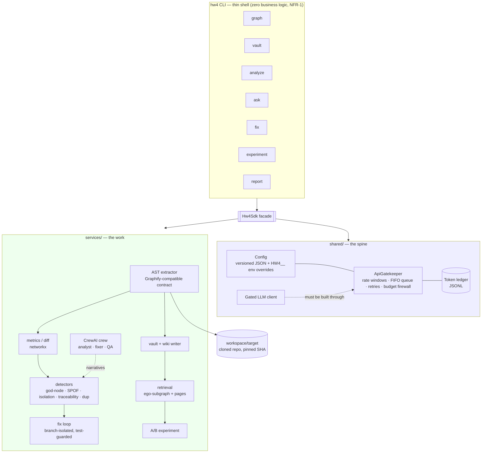
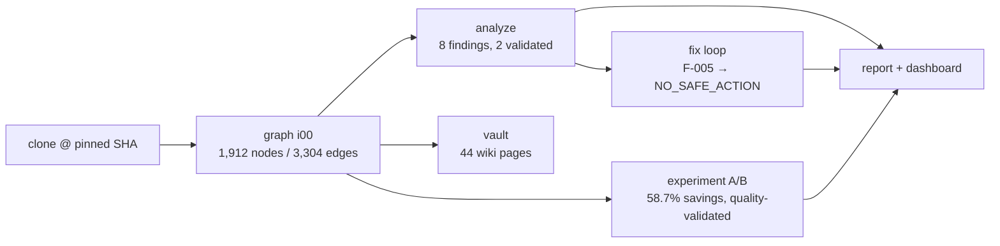
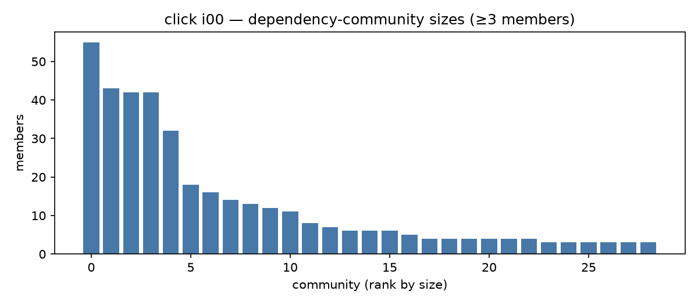
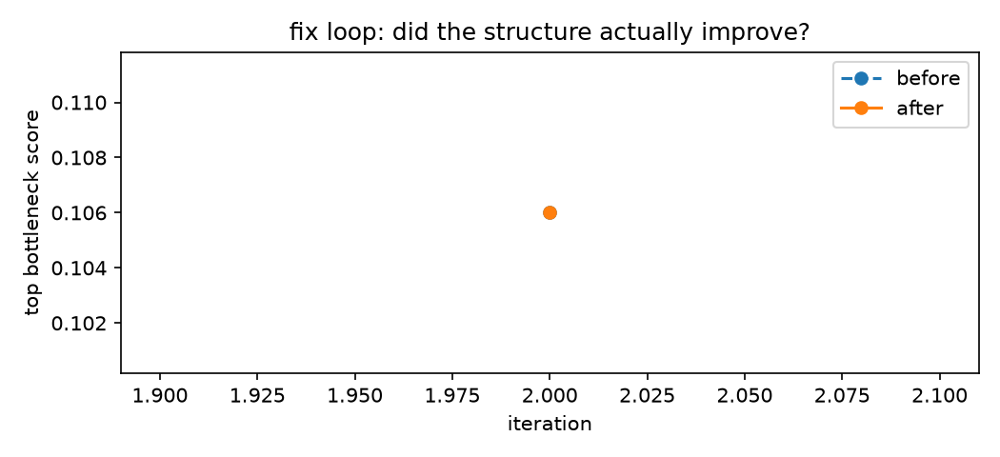
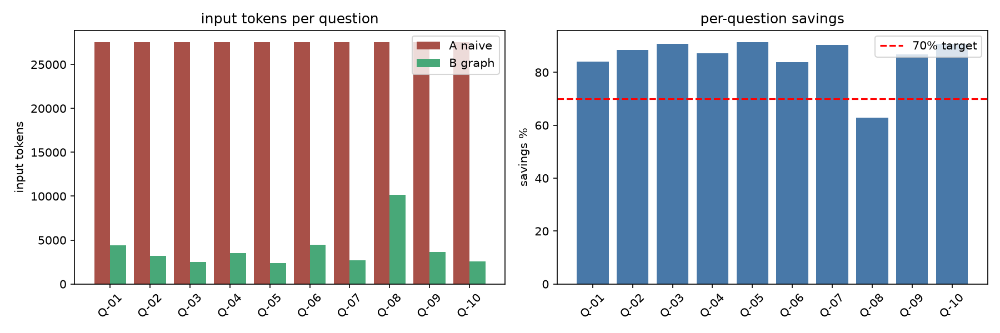
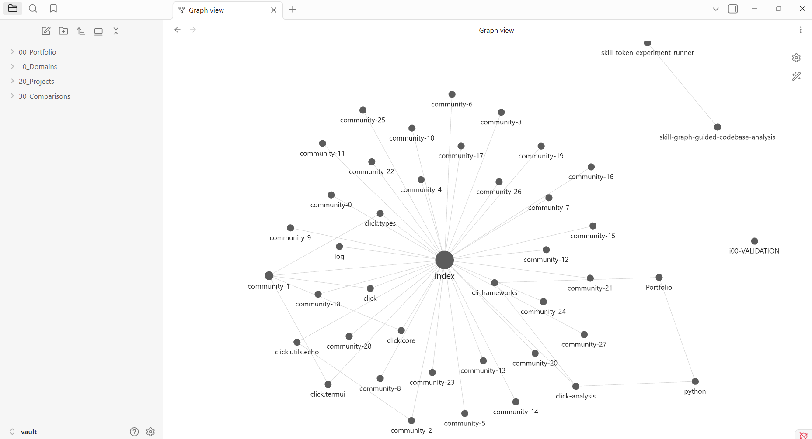
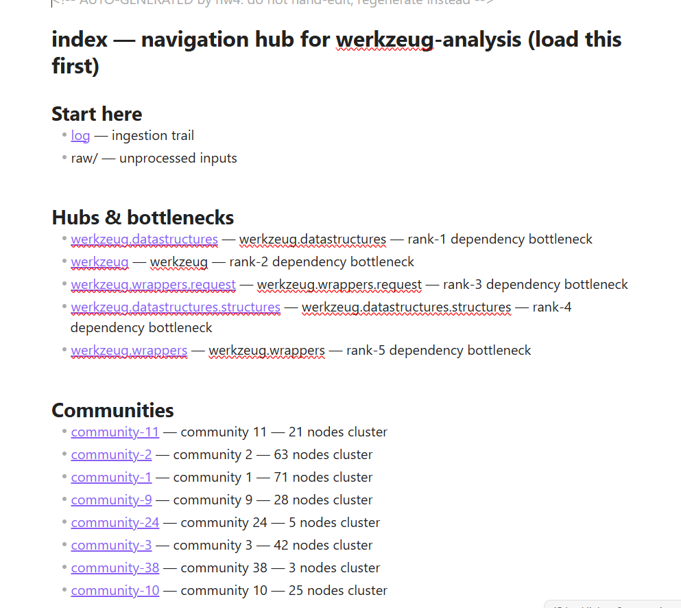
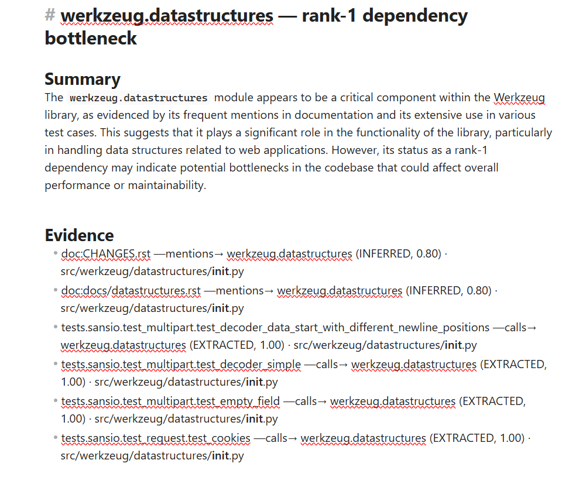
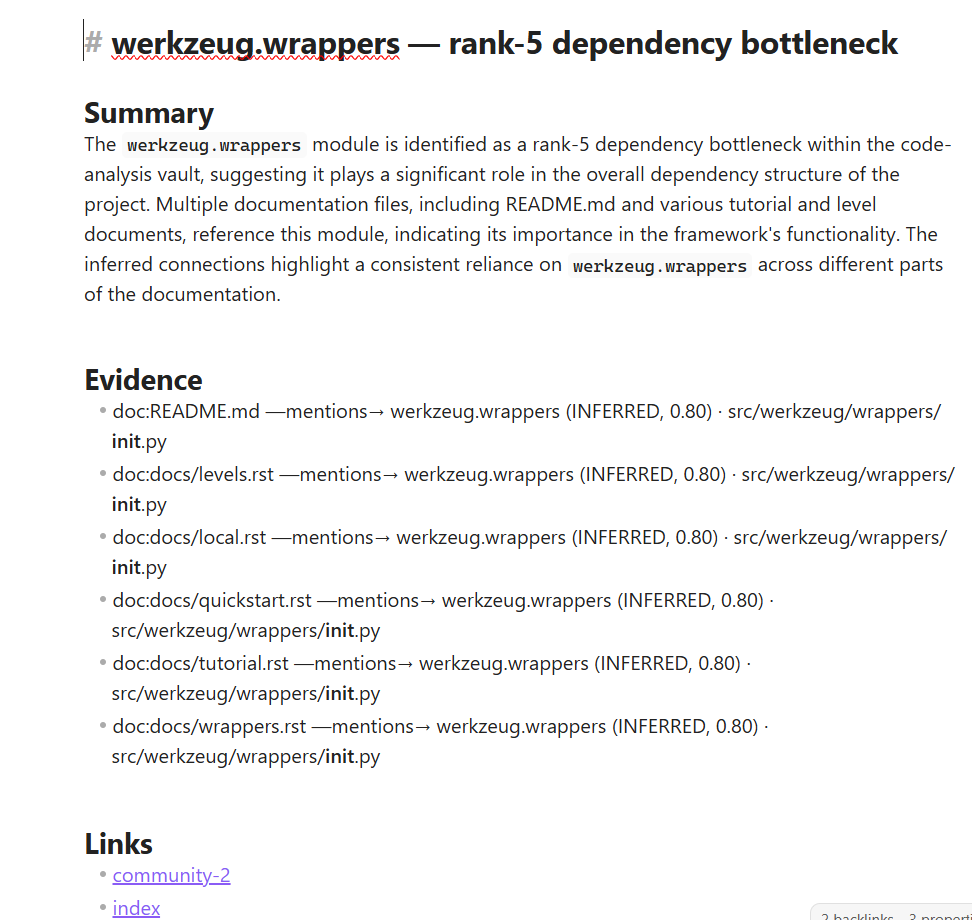

# HW4 — EX04: Graph-Based Reverse Engineering with AI Agents

> Reverse-engineer an **unfamiliar** Python repository the way a senior engineer would if they had a knowledge graph and a disciplined agent crew: build a dependency graph, navigate it as an Obsidian vault + LLM wiki, detect **architectural** defects with evidence-chained findings, attempt a **test-guarded** fix, and **prove** that graph-guided retrieval is cheaper than naive context-stuffing in a frozen A/B experiment.

**Target analysed:** [`pallets/werkzeug`](https://github.com/pallets/werkzeug) @ `1b00618e` — the WSGI toolkit under Flask (138 `.py` files / 27,498 LOC).

> Course: **Lecture 07 — Reverse Engineering of Graph Knowledge Systems** (Dr. Yoram Segal, June 2026).
> Governing docs: [`docs/PRD.md`](docs/PRD.md), [`docs/PLAN.md`](docs/PLAN.md), [`docs/TODO.md`](docs/TODO.md) (515 tasks), and **6 dedicated mechanism PRDs**.

---

## TL;DR — headline results

| KPI (PRD §3.2) | Target | Result | Evidence |
|---|---|---|---|
| **Token savings + quality** (rubric KPI) | savings, with B correctness & citation ≥ A | ✅ **58.7%** savings with blind quality B≥A (correctness 1.20≥1.15, citation 0.70≥0.65) | [`results/experiment/SCORING.md`](results/experiment/SCORING.md) |
| **Validated architectural defects** | ≥ 2 | ✅ **2** — `http` god-node (F-005), `datastructures` god-node (F-001) | [`results/FINDINGS.md`](results/FINDINGS.md) §3 |
| **Automated fix** (tests green + graph improves) | ≥ 1 or honest analysis | ✅ **honest NO_SAFE_ACTION** (green but no structural gain → reverted) | [`results/loop_log.json`](results/loop_log.json), `results/dashboard.md` |
| **Coverage** | ≥ 85% | ✅ **≈96%** | `scripts/check_gates.py` |
| **Quality gates** | ruff 0 · ≤150 code-lines/file · no hardcodes/secrets | ✅ **GREEN** | `scripts/check_gates.py` |
| **Cost discipline** | under $10 firewall, every call ledgered | ✅ **$0.088** / 109 calls | [`results/ledger.jsonl`](results/ledger.jsonl) |

*The validated result is **58.7% savings with answer quality ≥ naive** (blind LLM-as-judge scoring, `results/experiment/SCORING.md`). Pushing to 89.8% savings (run-2) broke quality — reported honestly as the savings/quality cliff, not the headline.*

## Table of contents

1. [What this is & why a graph](#what-this-is--why-a-graph)
2. [Architecture](#architecture)
3. [The pipeline, stage by stage](#the-pipeline-stage-by-stage)
4. [Installation](#installation)
5. [Usage tour](#usage-tour)
6. [Results deep-dive](#results-deep-dive)
7. [Evidence discipline (Part-C)](#evidence-discipline-part-c)
8. [Configuration guide](#configuration-guide)
9. [Repository layout](#repository-layout)
10. [Key design decisions (ADRs)](#key-design-decisions-adrs)
11. [Reproducing the analysis](#reproducing-the-analysis)
12. [Quality, cost & limitations](#quality-cost--limitations)
13. [License & attribution](#license--attribution)

---

## What this is & why a graph

Pasting whole files into a model to ask "how does this repo work?" burns the context window before insight arrives, and — per *Lost in the Middle* (Liu et al., 2024) — buries the relevant lines where attention is weakest. This project replaces file-stuffing with a **knowledge graph** of the codebase and retrieves only the **ego-subgraph + distilled wiki pages** a question actually needs.

The deliverable answers three task tiers over any repo:

- **locate** — "where is X implemented?"
- **trace-path** — "how does a request become a response?"
- **impact** — "what breaks if I change Y?"

…and goes further: it **detects** architectural smells (god modules, single points of failure, isolation, doc↔code traceability gaps), **attempts to fix** them under a test-and-graph-diff guard, and **measures** the token economics of the whole approach.

A guiding rule throughout: **deterministic spine, LLM at the edges.** Graph extraction, metrics, community detection, diffs, detectors, and loop control are plain, testable Python. The LLM only writes narratives, plans, and edits — and never without passing through the gate.

## Architecture



**Layer sizes:** `sdk/` 6 files · `shared/` 9 files · `services/` 44 files (≈4.9k code lines of project source, every file ≤150 code lines by gate).

## The pipeline, stage by stage



| Stage | What it produces | Determinism |
|---|---|---|
| **graph** | immutable `results/graphs/iNN/{graph,manifest,metrics}.json` | content-hash identical on rebuild (proven in `VALIDATION.md`) |
| **analyze** | `findings.json` + careful-language `FINDINGS.md`; `--agents` adds CrewAI narratives | findings identical with or without agents |
| **evaluate** | `confusion_matrix.json` + `CONFUSION_MATRIX.md` — detector predictions scored vs the planted answer key (L07 §13.2) | no LLM/network; reproducible TP/FP/FN/TN |
| **vault** | Obsidian taxonomy (Portfolio→Domains→Projects) + raw/ snapshots + LLM `wiki/` + machine-owned `index.md` | skeleton never clobbered; index regenerated |
| **fix** | `fix/<id>` branch, characterization tests if needed, `loop_log.json`, per-iteration graph diffs | every iteration logged, accepted **or** reverted |
| **experiment** | paired/repeated `condition_{A,B}.json`, `comparison.json`, blind `scoring_sheet.json` + sealed key | seeded shuffle, resume-on-crash, tokens from API metadata only |
| **report** | `REPORT.md` + Refactor Truth Dashboard | aggregates committed artifacts |

## Installation

Prerequisites: `git` and [uv](https://docs.astral.sh/uv/) (`curl -LsSf https://astral.sh/uv/install.sh | sh`). uv provisions the pinned Python automatically (developed on uv-managed CPython 3.12.13; `requires-python >=3.10`). **No pip, no manual venv — uv only.**

```bash
git clone https://github.com/yosefshanaa/HW4 && cd HW4
uv sync                                   # full environment from uv.lock
cp .env-example .env                       # then add a real key for the configured provider
                                           # (llm.provider in config/setup.json; currently OPENAI_API_KEY)
uv run pytest -q                           # ~350 tests, coverage gate 85%
uv run python scripts/check_gates.py       # all submission gates → GATES: GREEN
```

**Troubleshooting (issues we actually hit):**
- *`uv run` appears to hang for minutes* — on a Windows `/mnt/c` mount uv re-copies the venv (no hardlinks). Don't run two `uv run` concurrently; let one `UV_LINK_MODE=copy uv sync` finish.
- *`Failed to spawn: hw4` right after a fresh sync* — the console script wasn't flushed yet; re-run, or use `uv run --no-sync hw4 …`.
- *`.env` not picked up* — load it explicitly: `set -a && . ./.env && set +a`. Watch for editors saving `.env` as `.env.txt`.

## Usage tour

The CLI is a 1:1 thin shell over `Hw4Sdk`:

```bash
uv run hw4 graph workspace/target            # immutable graph iteration + metrics
uv run hw4 analyze                           # detectors → results/findings.json + FINDINGS.md
uv run hw4 analyze --agents                  # same findings + CrewAI careful-language narratives
uv run hw4 evaluate                          # confusion matrix vs mini_repo answer key (L07 §13.2)
uv run hw4 vault                             # Obsidian vault + LLM wiki pages
uv run hw4 ask "where is the routing Map implemented?"  # graph-guided, cited answer
uv run hw4 fix F-005                          # test-guarded fix loop on a validated finding
uv run hw4 experiment --condition both        # frozen A/B token experiment
uv run hw4 report --dashboard                 # REPORT.md + Refactor Truth Dashboard
```

Example — the deterministic-vs-agent equivalence (a graded claim): `analyze` and `analyze --agents` produce **byte-identical `findings.json`**; the crew only adds prose. *Determinism for the science, agents for the demonstration.*

### Graph backend — AST (default) or Graphify (ADR-4)

The course tool [Graphify](https://github.com/safishamsi/graphify) ([graphify.net](https://graphify.net/)) is a real, obtainable Tree-sitter + NetworkX extractor that exports `graph.json` in **node-link format**. `hw4` ships a tested adapter that ingests that genuine output, so you can run either backend via `config/setup.json → graph.backend`:

```bash
# Default: the in-repo AST backend (deterministic, token-free, reproducible) —
# all committed findings/experiment artifacts are built with this.
uv run hw4 graph workspace/target

# Graphify backend: run Graphify yourself, then point hw4 at its graph.json.
npx graphify .                                          # produces ./graph.json (node-link)
HW4__graph__backend=graphify \
HW4__graph__graphify__graph_json=$PWD/graph.json \
  uv run hw4 graph workspace/target                     # adapter normalizes → our contract

# Or let hw4 invoke Graphify for you (cwd = repo) via a configured command:
#   "graph": { "backend": "graphify", "graphify": { "command": ["npx","graphify","."] } }
```

The adapter (`src/hw4/services/extractor/graphify.py`) only translates structure (`links`→edges, `source`/`target`→`src`/`dst`, Graphify's `confidence` evidence class → our `evidence` + `confidence_score`→confidence, `file_type`→node type) and validates at the single `Graph.from_dict` boundary. **We keep AST as the default on purpose:** the frozen experiment, findings, and content-hash determinism must reproduce without an external tool — Graphify is an honest drop-in, not a swap that would invalidate committed evidence (see ADR-4 in [`docs/PLAN.md`](docs/PLAN.md)).

## Results deep-dive

### Target repository

| Field | Value |
|---|---|
| Repo / SHA | `pallets/werkzeug` @ `1b00618e787f40dfb21eba29caf8f8be7c8e1d93` (detached) |
| Size | 27,498 code lines / **138 `.py` files** (src-only `src/werkzeug`: 16,829 / 52) |
| License | BSD-3-Clause (attribution preserved below) |
| Test baseline | **992 passed, 0 skipped, 0 xfailed in ~60 s** (stable across 2 runs, no serving-port flakes) |

Selection trail, naive pre-graph impression, and the unfamiliarity attestation live in [`docs/TARGET_REPO.md`](docs/TARGET_REPO.md).

### Graph (iteration 0)

`ast_extractor/1.00` · content hash `54274cf9…` (reproduced identically on rebuild).

| Nodes: **1,912** | Edges: **3,304** |
|---|---|
| function 1,553 · class 219 · module 84 · doc 43 · rationale 13 | implements 1,932 · calls 747 · imports 369 · tested_by 186 · mentions 57 · rationale_for 13 |
| 1,267 communities (1,204 singletons, ~39 real clusters) | evidence: **EXTRACTED 3,235 · INFERRED 68 · AMBIGUOUS 1** |



### Findings — 7 god-nodes + 1 traceability gap, 2 validated

| ID | Kind | Node | Verdict | Why |
|---|---|---|---|---|
| **F-005** | GOD_NODE | `werkzeug.http` | ✅ **validated** | 1,543 LOC bundling ≥6 header families (cookies, etags, dates, ranges, accept/cache-control/csp); fan-in **21** importers, no per-concern seam |
| **F-001** | GOD_NODE | `werkzeug.datastructures` | ✅ **validated** | rank-1 bottleneck; degree 76, fan-in 66, reaches 11 communities — a namespace backbone re-exporting ~10 container families |
| F-002 / F-003 | GOD_NODE | `wrappers.request` / `.response` | rejected | deliberate public façades over the `sansio` core |
| F-004 | GOD_NODE | `exceptions` | rejected | cross-cutting error layer; high fan-in is the protocol, one cohesive concern |
| F-006 / F-007 | GOD_NODE | `test.run_wsgi_app` / `utils` | rejected | test driver / low-cohesion utility grab-bag, not entangled cores |
| F-008 | TRACE_GAP | `wsgi.make_line_iter` | rejected | changelog records its **removal**; the symbol is correctly absent |

**No SPOF finding** — no node reaches `mandatory_path_ratio ≥ 0.3` (highest is `datastructures` at 0.106). werkzeug's hubs are reachable by multiple paths, unlike click's seam-less `echo`. Reported honestly rather than forced. Full 5-step inference per validated finding, plus the rejected-hypothesis analysis and block/class diagrams, in [`results/FINDINGS.md`](results/FINDINGS.md).

### Agent evaluation — confusion matrix on the planted fixture (L07 §13.2)

The detectors are a binary classifier, so they get a classifier's yardstick. `hw4 evaluate` runs the deterministic spine over [`tests/fixtures/mini_repo`](tests/fixtures/mini_repo) — a synthetic target whose README documents its planted defects *and* two false-positive guards — and scores findings against the machine-readable answer key. No LLM, no network; fully reproducible.

| | Actual defect | Actual clean | | Metric | Value |
|---|---|---|---|---|---|
| **Pred defect** | TP = 3 | FP = 1 | | Precision | **0.75** |
| **Pred clean** | FN = 0 | TN = 2 | | Recall | **1.00** |

**Recall 1.00** — all three planted defects (god-node `app.engine`, orphan `orphan.legacy`, doc gap `app.plugins`) detected. The lone **FP** is the fixture's `conftest.py`: genuinely disconnected, so the isolation detector surfaces it for triage — reported as an honest precision cost, not hidden, in keeping with Part-C's "isolation is a finding, not a diagnosis." The healthy-hub guard (`app.utils`, high fan-in / one concern) stays unflagged — the two true negatives that keep precision from collapsing. We publish the real 0.75, not a hand-tuned 1.0. Full breakdown: [`results/CONFUSION_MATRIX.md`](results/CONFUSION_MATRIX.md), design in [`docs/PRD_agent_evaluation.md`](docs/PRD_agent_evaluation.md).

### Fix loop — an honest negative (T340)

The loop targeted the validated `http` god-node with the bounded GOD_NODE strategy (*extract the smallest cohesive group of private helpers into a sibling module, import them back, do not touch the public API*).

| Iteration | Target | Tests | Structure | Verdict |
|---|---|---|---|---|
| i02 | F-005 `http` | **992/992 green** (behavior preserved) | bottleneck 0.106 → 0.106; isolated 1250 → 1253 | **regressed → REVERTED** |

**Stop reason: `NO_SAFE_ACTION`.** The extraction was behavior-preserving but didn't *improve* the structure (the god-node's fan-in of 21 external importers is unchanged by relocating private helpers), so the graph-diff guard reverted it. A green-but-non-improving refactor is **rejected, not faked** — the loop empirically restated finding F-005.



### Token experiment — 58.7% savings *with quality preserved* (the honest result)

10 questions (3 locate / 4 path / 3 impact), each spot-checked against source; 2 conditions × 2 repetitions; temperature 0; tokens taken **only** from provider API metadata via the ledger. Dataset sha256-sealed. Answer quality was scored **blind** by an LLM-as-judge (condition masked; sealed key opened only to tally) against the reference answers — full breakdown in [`results/experiment/SCORING.md`](results/experiment/SCORING.md).

| Run | Retrieval caps | Cond B tok/cell | Savings | Blind quality (B vs A) | Rubric KPI |
|---|---|---|---|---|---|
| **Run 1** (validated) | radius 2 · 40 nodes · 3 seeds · 3 pages (default) | ~6.5k | **58.7%** | correctness **1.20 ≥ 1.15**, citation **0.70 ≥ 0.65** | ✅ **PASS** |
| Run 2 (over-tuned) | radius 1 · 20 nodes · 2 seeds · 2 pages | ~1.6k | 89.8% | correctness **0.50 ≪ 1.15**, citation 0.30 | ❌ FAIL |

**The validated result is Run 1: ~59% input-token savings (313,440 → 129,536) with answer quality *on par with, slightly above* naive context-stuffing** — the rubric KPI (B correctness *and* citation ≥ A) passes. Run 2 chased the ≥70% aspiration by tightening retrieval to ~1.6k tok/cell, but that **starved Condition B of context** → a wave of *"the material does not contain…"* non-answers, collapsing quality (KPI fail). Run 2 is archived (`*_run2.json`) and reported as the sensitivity study's **quality cliff**, not a result.

The honest finding: **for this target, ≥70% savings and preserved quality are in tension** — you get quality-preserving ~59% savings, or push toward ~90% and lose correctness. The safe operating point is the default caps (Run 1).



> Methodology note: quality was scored by an **LLM-as-judge** (transparently labeled — *not* presented as human evaluation), a standard technique for an AI-orchestration course. The masked sheet + sealed key implement genuine blinding, and `results/experiment/scoring_worksheet.csv` supports an independent human re-score.

### The Obsidian vault

The graph becomes a navigable Obsidian vault under `vault/20_Projects/werkzeug-analysis/`: an **index-first** hub (the only default entry point), one LLM **wiki page per key entity** (5 hubs + 39 community pages), `raw/` provenance snapshots kept separate from distilled notes, and the SKILL protocol mirrored in-vault.

| Graph view — `index` at the centre, community clusters radiating out | `index.md` — the machine-owned navigation hub |
|---|---|
|  |  |
| **`werkzeug.datastructures` wiki — rank-1 god-node (F-001)** | **`werkzeug.wrappers` wiki — rank-5 dependency hub** |
|  |  |

Each wiki page carries an **evidence table** (EXTRACTED/INFERRED edges with their source files and confidence) plus open questions; the index ranks hubs by the graph's bottleneck metrics. The community-size and experiment charts elsewhere in this README are exported by the notebook (`assets/`).

## Evidence discipline (Part-C)

Every claim carries an **evidence class**, end to end (extractor → findings → fix-eligibility):

| Class | Meaning | Policy |
|---|---|---|
| **EXTRACTED** | read directly from syntax (conf 1.0 / 0.9) | may state as fact; only EXTRACTED-only findings are fix-eligible |
| **INFERRED** | unique-symbol resolution of a bare name (conf 0.6) | must be hedged with its confidence |
| **AMBIGUOUS** | a documented dotted-path that resolves to nothing | a **stop-flag** for human triage — never an input to automated change |

This is why the single AMBIGUOUS edge (the removed `make_line_iter`) was triaged by a human, not silently consumed, and why the fix loop refuses to touch a finding whose chain isn't EXTRACTED end-to-end.

## Configuration guide

All tunables live in versioned JSON under `config/` (zero hardcoded values in code); **secrets come only from the environment.**

| File | Purpose |
|---|---|
| `setup.json` | models, retrieval caps, detector thresholds, budget, vault project/domains, fixloop test command |
| `rate_limits.json` | per-service rate windows for the gatekeeper |
| `logging_config.json` | structured-logging setup |

**Override convention:** any key can be overridden at runtime with `HW4__<dotted__path>` (e.g. `HW4__retrieval__ego_radius=1` — exactly how run 2 was tuned without editing committed config). **Secrets** (`OPENAI_API_KEY`) are read from the environment via `config.get_secret()` and never from JSON — a committed config can't leak a key.

Selected `setup.json` keys:

| Key | Default | Effect |
|---|---|---|
| `models.{cheap,strong}` | `gpt-4o-mini` | tier routing (narratives = cheap, edits/experiment = strong) |
| `retrieval.{ego_radius,max_nodes,max_seeds,k_pages}` | 2 / 40 / 3 / 3 | graph-context size (run 2 → 1 / 20 / 2 / 2) |
| `budget.{max_usd,warn_usd}` | 10 / 7 | firewall + warn threshold |
| `loop.{max_iterations,step_timeout_seconds}` | 3 / 300 | fix-loop bounds |
| `fixloop.test_command` | `uv run --no-project --isolated …` | target's suite (`--isolated` keeps werkzeug's `[tool.uv]` dev-groups out) |

## Repository layout

| Path | Purpose |
|---|---|
| `src/hw4/sdk/` | `Hw4Sdk` facade + operation modules (CLI & agents hold zero logic) |
| `src/hw4/shared/` | config, **API Gatekeeper**, token ledger, process runner, gated LLM client |
| `src/hw4/services/` | extractor, metrics/diff, vault+wiki, retrieval, detectors, fix loop, experiment, CrewAI, dashboard |
| `tests/` | unit+integration, mirrors `src/` 1:1; `tests/fixtures/mini_repo/` is the planted-defect answer key |
| `config/` | versioned JSON — zero hardcoded values; secrets only via env |
| `docs/` | PRD/PLAN/TODO, **6 mechanism PRDs**, SKILL protocols, SCORING_RUBRIC, PROMPTS log, TARGET_REPO |
| `data/` | frozen question dataset (sha256-sealed in `PRD_token_experiment.md`) |
| `results/` | graph iterations, findings, FINDINGS.md, loop log, experiment artifacts, ledger, REPORT, dashboard |
| `notebooks/` | `analysis.ipynb` — restart-and-run-all from committed artifacts |
| `vault/` | Obsidian vault (taxonomy + wiki incl. SKILL mirrors) |
| `workspace/` | target clone (gitignored; regenerate via `RepoService.clone(url, commit=<SHA>)`) |

## Key design decisions (ADRs in `docs/PLAN.md` §5)

- **One choke point** for every external call (`ApiGatekeeper`): rate limits, queue-not-drop, bounded retries, budget firewall, JSONL ledger. The LLM client *cannot be constructed* without it.
- **Evidence as a first-class enum** from extractor to fix-eligibility (above).
- **Deterministic spine, LLM at the edges** — metrics/diffs/detectors/loop are plain Python; the LLM writes narratives, plans, and edits only, through the gate.
- **Graphify fallback executed** (ADR-4): the course tool was unobtainable; the in-repo AST backend emits the identical contract, stamped so a future real run is distinguishable.
- **Provider-swappable** (ADR-3): proven live by config-switching to OpenAI `gpt-4o-mini` for both tiers.

## Reproducing the analysis

```bash
# 1. clone the target at the pinned SHA (gitignored workspace)
uv run hw4 graph https://github.com/pallets/werkzeug   # or RepoService.clone(url, commit=<SHA>)

# 2. deterministic graph (identical content hash on rebuild — see VALIDATION.md)
uv run hw4 graph workspace/target --iteration 0

# 3. detectors → 8 hypotheses; 2 validations + 6 reasoned rejections
uv run hw4 analyze

# 4. notebook: build + execute headlessly from committed artifacts
uv run --with nbformat python scripts/build_notebook.py
uv run --with nbformat --with nbclient --with ipykernel --with matplotlib python scripts/execute_notebook.py
```

## Quality, cost & limitations

- **Gates (law before every commit):** `scripts/check_gates.py` → ruff 0 · pytest+coverage ≈96% · every file ≤150 code lines · no hardcodes in `src/` · no secrets in tracked files · no broken vault wikilinks → **GATES: GREEN**.
- **Cost:** the entire werkzeug run cost **$0.088** of the $10 firewall across **109 gated calls** (vault wiki + fix-loop edit + 60 experiment cells over runs 1–2 + agent narratives), every one ledgered. The retired click run's ledger is preserved in git history.
- **Honest limitations:**
  - Quality was scored by a **blind LLM-as-judge** (transparently labeled, not a human panel); `results/experiment/SCORING.md` documents the method and supports an independent human re-score. For this target the ≥70% *savings aspiration* conflicts with quality (run-2 over-tuning) — the validated headline is the quality-preserving 58.7%.
  - The fix loop produced a NO_SAFE_ACTION (a valid, evidenced negative), not a green merge.
  - Graph backend is the AST fallback, not the course's Graphify (ADR-4); the contract is identical but a real run would be re-validated.
  - Module-level constants/attributes aren't in the symbol index (a known INFERRED-layer precision cost, documented in `PRD_graph_pipeline.md`).

## License & attribution

This project: **MIT** (see `pyproject.toml`).
Target repository **`pallets/werkzeug`** is **BSD-3-Clause** (© Pallets) — used here for educational analysis with attribution; provenance and license trail in `docs/TARGET_REPO.md`.
Grounding references: Liu et al. 2024, *Lost in the Middle* (TACL); Vaswani et al. 2017, *Attention Is All You Need*.
