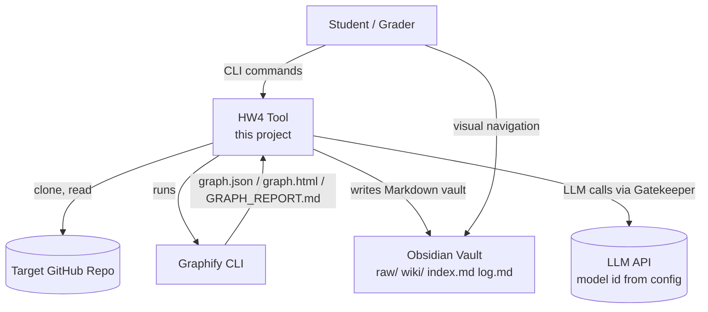
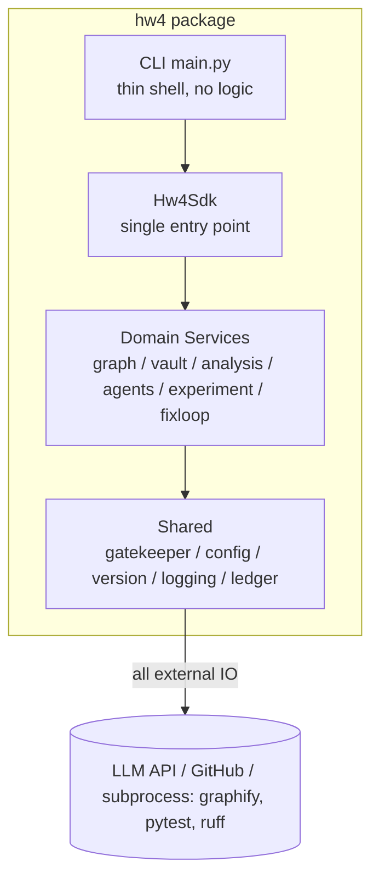

# PLAN — EX04: Architecture & Technical Plan

| Field | Value |
|---|---|
| Document | Architecture / Planning document (PLAN) |
| Project | EX04 — Graph-Based Reverse Engineering + Architectural-Bug-Fixing AI Agents |
| Version | 1.00 |
| Status | DRAFT — approval gate before implementation |
| Parent | docs/PRD.md v1.00 (requirement IDs FR-x / NFR-x referenced throughout) |

---

## 1. Architecture Overview

The system is two architectures in one, deliberately separated:

1. **The knowledge architecture** (what the assignment teaches): the three-layer model — *Files → Graphify → Obsidian* (L07 §3) — extended by Part-B into *Graph (structure) + LLM Wiki (semantics) + SKILLs (action protocol) + Context Engineering (attention control)*.
2. **The software architecture** (what the guidelines demand): an SDK-centric Python package whose CLI, agents, and experiments are all thin consumers of one `Hw4Sdk` entry point, with a single API Gatekeeper choke point for every external call.

### 1.1 C4 Level 1 — System Context



### 1.2 C4 Level 2 — Containers (inside HW4)



Rules (NFR-1, NFR-2):
- CLI and agent definitions contain **zero business logic** — they delegate to the SDK.
- No module except `shared/gatekeeper.py` may perform an external API call. Subprocess execution (graphify, git, pytest on target) is wrapped by a single `ProcessRunner` in shared, for the same reasons (logging, timeout, testability).

### 1.3 C4 Level 3 — Components / target file map

All files ≤150 code lines (NFR-8). Planned split is below; if any file approaches the limit the split strategies of guidelines §3.2 apply (extract helpers / mixins / constants / models).

```
HW4/
├── src/hw4/
│   ├── __init__.py                  # exports Hw4Sdk, __version__
│   ├── main.py                      # CLI entry — DECIDED (T025): stdlib argparse, cuts a dep — thin
│   ├── constants.py                 # immutable constants, Enums (EdgeEvidence, FindingKind, StopReason)
│   ├── sdk/
│   │   ├── __init__.py
│   │   └── sdk.py                   # Hw4Sdk facade: build_graph, build_vault, analyze, ask, fix, experiment, report
│   ├── services/
│   │   ├── __init__.py
│   │   ├── repo_service.py          # clone, checkout, provenance, LOC stats        (FR-1)
│   │   ├── graph_runner.py          # graphify subprocess orchestration             (FR-2.1–2.2)
│   │   ├── graph_models.py          # Node/Edge/Graph dataclasses + json load/dump  (FR-2.3–2.4)
│   │   ├── graph_metrics.py         # degree/betweenness/communities/bridges        (FR-2.5)
│   │   ├── graph_diff.py            # iteration diff + structural verdict           (FR-2.7)
│   │   ├── vault_builder.py         # vault skeleton, taxonomy, index/log           (FR-3.1–3.2)
│   │   ├── wiki_writer.py           # wiki page generation, frontmatter, wikilinks  (FR-3.3)
│   │   ├── retrieval.py             # index-first focused subgraph/wiki retrieval   (FR-3.4, FR-8.3)
│   │   ├── detectors/
│   │   │   ├── __init__.py
│   │   │   ├── base.py              # Detector ABC, Finding model, evidence chain   (FR-6)
│   │   │   ├── spof.py              # SPOF / mandatory path
│   │   │   ├── god_node.py          # god node vs healthy hub adjudication
│   │   │   ├── isolation.py         # isolated cluster classifier
│   │   │   ├── traceability.py      # docs-without-code gaps
│   │   │   └── duplication.py       # semantic-similarity duplication hypotheses
│   │   ├── agents/
│   │   │   ├── __init__.py
│   │   │   ├── crew.py              # crew/graph wiring, orchestration              (FR-5.3)
│   │   │   ├── roles.py             # role/goal/backstory definitions               (FR-5.2)
│   │   │   ├── tools.py             # agent tools — all delegate to SDK services    (FR-5.4)
│   │   │   └── context.py           # context packing: edges placement, compaction  (FR-5.5)
│   │   ├── fixloop/
│   │   │   ├── __init__.py
│   │   │   ├── planner.py           # finding → refactor plan
│   │   │   ├── applier.py           # branch, edit application, characterization tests (FR-7.5)
│   │   │   ├── stop.py              # stop-condition evaluation                     (FR-7.2)
│   │   │   └── loop.py              # iterate: fix→test→re-graph→diff→verdict       (FR-7.1, 7.4)
│   │   └── experiment/
│   │       ├── __init__.py
│   │       ├── questions.py         # question dataset loader/validator             (FR-8.1)
│   │       ├── conditions.py        # condition A (naive) / B (graph-guided) builders (FR-8.2–8.3)
│   │       ├── runner.py            # paired runs, repetition, ledger join          (FR-8.4)
│   │       └── scoring.py           # answer-quality rubric scoring                 (FR-8.5)
│   └── shared/
│       ├── __init__.py
│       ├── gatekeeper.py            # ApiGatekeeper: rate limit, FIFO queue, retry, log (NFR-2)
│       ├── llm_client.py            # provider adapter(s) behind one interface; model id from config
│       ├── ledger.py                # token/cost ledger (per call, per phase)       (NFR-13)
│       ├── config.py                # layered config loader + version validation    (NFR-5, NFR-6)
│       ├── version.py               # __version__ = "1.00"
│       ├── process_runner.py        # subprocess wrapper (graphify/git/pytest/ruff)
│       └── logging_setup.py         # structured logging
├── tests/
│   ├── conftest.py                  # fixtures: fake graph.json, mock LLM, tmp repo
│   ├── unit/                        # mirrors src structure 1:1
│   └── integration/                 # end-to-end on a tiny synthetic repo fixture
├── config/
│   ├── setup.json                   # version, paths, model ids, retrieval k, loop caps
│   ├── rate_limits.json             # version + per-service limits
│   └── logging_config.json
├── docs/                            # PRD, PLAN, TODO, PRD_*.md, PROMPTS.md, TARGET_REPO.md, SKILL.md
├── vault/                           # Obsidian vault (committed)
│   ├── 00_Portfolio/ 10_Domains/ 20_Projects/ 30_Comparisons/
│   └── <project>/raw|wiki|index.md|log.md
├── data/                            # question dataset, answer key
├── results/                         # graphs/<iter>/, findings.json, loop_log.json, experiment/, figures/
├── notebooks/analysis.ipynb         # results analysis notebook (NFR-12)
├── workspace/                       # cloned target repo (gitignored)
├── README.md  pyproject.toml  uv.lock  .env-example  .gitignore
```

Critical note: `detectors/`, `agents/`, `fixloop/`, `experiment/` are sub-packages precisely to keep every file under 150 lines without artificial compression.

## 2. Knowledge-Layer Design (the assignment substance)

### 2.1 Graph contract (data schema)

`graph_models.py` defines the internal contract; whatever Graphify emits is normalized into it:

```json
{
  "version": "1.00",
  "iteration": 0,
  "nodes": [{"id": "n1", "type": "function|class|module|doc|rationale", "label": "...", "source_file": "path", "community": 3}],
  "edges": [{"src": "n1", "dst": "n2", "relation": "calls|imports|implements|mentions|tested_by|rationale_for|semantically_similar_to", "evidence": "EXTRACTED|INFERRED|AMBIGUOUS", "confidence": 0.88}]
}
```

Design rationale: Part-C demands that every conclusion trace to relation + confidence + source_file; making evidence a first-class enum forces every downstream consumer (detectors, agents, findings) to carry it. AMBIGUOUS edges are *flags for human check*, never inputs to automated fixes.

### 2.2 Graph metrics

- degree, fan-in/fan-out per node; betweenness centrality (networkx); community detection (greedy modularity or Louvain); bridge detection; isolated component listing.
- Hub-vs-bottleneck adjudication (Part-C): `bottleneck_score = betweenness_rank × mandatory_path_ratio`, plus qualitative check of relation types — encoded as a rubric, output as evidence text, never as an automatic verdict.

### 2.3 Vault & LLM Wiki

- Taxonomy: Portfolio → Domain (Python / target-repo domain) → Project (this analysis) — two domains can live in one project (L07 §5).
- Each wiki page: frontmatter `type/status/project`, one concept per page, wikilinks; pages are short (≤~40 lines) and written for re-retrieval (Part-B).
- `index.md` is the navigation hub and is the ONLY thing loaded by default; `log.md` records every ingestion (what, when, source) for traceability.
- The most important line of every file is its title (L07 §5 "graph over skills") — titles are written as routing descriptions.
- Language policy — DECIDED (T093): vault and all generated docs in English; Hebrew only where a course term has no faithful translation, given with an inline gloss.

### 2.4 Retrieval discipline (token engine)

`retrieval.py` implements: parse question → match index entries → load focused subgraph (ego-graph radius ≤2 around matched nodes, capped at K nodes) + 2–3 wiki pages → assemble context with critical instructions at the START and the question at the END (edge placement, Part-B position-aware design). Compaction utility summarizes loop history between iterations.

## 3. Agent Design (FR-5)

### 3.1 Roles

| Agent | Goal | Tools (all SDK-backed) | Notes |
|---|---|---|---|
| Orchestrator | run the loop, route tasks, enforce budget | task router | thin; logic in fixloop/loop.py |
| RepoAgent | clone/update, run graphify, run target tests | repo_service, graph_runner, process_runner | no LLM needed for most steps (deterministic) — cheap |
| GraphAnalyst | metrics, detector execution, finding ranking, evidence write-up | graph_metrics, detectors, retrieval | LLM used for narrative, not for math |
| ArchitectFixer | refactor plan + code edits for a confirmed finding | retrieval, applier | strongest model; context = focused subgraph only |
| QAAgent | tests, ruff, graph diff verdict, stop condition | process_runner, graph_diff, stop | rejects iteration on any red |

Critical design stance: agents are **orchestration sugar over deterministic services**. Everything that can be computed without an LLM (metrics, diffs, test runs) is computed in plain Python — this is exactly the lecture's AST point (deterministic analysis is ~token-free) and keeps cost and flakiness down. The LLM is reserved for: interpreting evidence, writing refactor plans, generating code edits, and writing careful conclusions.

### 3.2 Handoffs

Typed payloads (dataclasses serialized to JSON): `AnalysisRequest`, `Finding`, `FixPlan`, `IterationVerdict`. No free-text blob handoffs — free text is where token waste and ambiguity live.

### 3.3 Loop control & stop conditions (FR-7.2)

```
while iteration < max_iterations:
    finding = next_confirmed_finding()            # EXTRACTED-validated only
    plan    = ArchitectFixer.plan(finding)
    diff    = ArchitectFixer.apply(plan)          # on branch fix/<finding-id>
    tests   = QAAgent.run_tests()                 # red ⇒ revert, mark finding blocked
    graph'  = RepoAgent.rerun_graphify()
    delta   = graph_diff(graph, graph')
    verdict = QAAgent.judge(tests, delta)         # improved? regressed? neutral?
    log_iteration(...)                            # loop_log.json
    if verdict.stop:                              # tests green + metric improved ≥ threshold,
        break                                     # or no safe next action, or budget cap
```

Stop reasons enumerated in `constants.StopReason`: `MAX_ITERATIONS`, `GOAL_METRIC_REACHED`, `TESTS_GREEN_NO_MORE_FINDINGS`, `BUDGET_EXCEEDED`, `NO_SAFE_ACTION`. Every run terminates with exactly one, logged.

## 4. Token Experiment Protocol (FR-8) — the science must be defensible

1. **Dataset**: `data/questions.yaml` — ≥10 questions, 3 difficulty tiers (locate / trace-path / impact-analysis), each with reference answer + reference source files (the answer key is built manually from the validated graph, then spot-checked against source).
2. **Condition A (naive)**: prompt = system + concatenated candidate files / all skill descriptions (mimicking "regular work", L07 §7) + question. Capped at model context; truncation logged (that's part of the finding).
3. **Condition B (graph-guided)**: prompt = system + index.md + focused subgraph (serialized, compact) + 2–3 wiki pages + question.
4. **Controls**: same model id, same temperature (0), same question wording, N=2 repetitions, randomized order; tokens from API usage metadata recorded by the Gatekeeper ledger (not estimated by a local tokenizer — estimates drift; if metadata is unavailable a tokenizer fallback is documented as a limitation).
5. **Scoring**: blind rubric — correct / partial / wrong + source-citation correctness; both teammates score, disagreements adjudicated.
6. **Analysis**: per-question table; total input/output tokens; % savings; cost in $; bar plots + savings distribution; explicit discussion of failures. Optional (P2): distractor-injection curve.

Threats to validity we explicitly document: answer-key bias (key built from the graph we are testing — mitigated by spot-check against raw source), small N, single repo, model nondeterminism (temp 0 + repetitions).

## 5. Architecture Decision Records (ADRs)

### ADR-1: Agent framework — CrewAI (recommended) over LangGraph
- **Options**: CrewAI (taught in the course's Part-B companion deck; role/crew abstraction; fastest to demo multi-agent orchestration) vs LangGraph (explicit state machine; native cycles; finer control).
- **Decision**: CrewAI for agent roles + plain-Python loop in `fixloop/loop.py` for iteration control. Rationale: the improvement loop demands deterministic control and auditability — putting it in framework graph-state adds risk without grade value; CrewAI aligns with course material; the lecture allows either.
- **Consequences**: loop logic is unit-testable without any LLM; if CrewAI's abstractions fight us, `crew.py` is the only file to swap (interface kept framework-agnostic).
- **Revisit if**: CrewAI version pins conflict with uv resolution, or tool-calling reliability is poor in practice.

### ADR-2: Target repository — mid-size real repo, BugsInPy only if it installs inside the timebox
- **Options**: (a) BugsInPy project (real field bugs, complex env), (b) mid-size standalone repo (e.g., a 5–30k LOC CLI/library with tests), (c) personal codebase (needs approval).
- **Decision**: primary = option (b) chosen from a pre-vetted shortlist of 3 candidates (selected in TODO Phase 3 by criteria: pure Python, 3–40k LOC, pytest suite, imports cleanly on py3.10+, permissive license, unfamiliar to us). BugsInPy attempted first **only** within a 90-minute timebox because the lecturer explicitly de-risked switching (L07 §11.2).
- **Consequences**: TARGET_REPO.md records the decision trail; grade-relevant learning is preserved either way.

### ADR-3: LLM provider/model — config-driven, two tiers
- **Decision**: model ids live in `config/setup.json` (`models.cheap`, `models.strong`); cheap tier for drafts/narratives, strong tier for refactor planning and final experiment runs. No model id appears in code (NFR-5). Provider adapter behind `llm_client.py` interface so a second provider is a config + adapter addition, not a rewrite.
- **Consequences**: cost control; experiment validity (single fixed model for both conditions).

### ADR-4: Two selectable backends — AST default, Graphify adapter (revised 2026-06-15)
- **Original trigger (2026-06-12)**: the Phase-4 discovery spike could not obtain a Graphify distribution (`pip`/PyPI 404), so we shipped a minimal `ast`-based extractor emitting our graph.json contract.
- **Revision (2026-06-15)**: Graphify *is* obtainable — [`safishamsi/graphify`](https://github.com/safishamsi/graphify) / [graphify.net](https://graphify.net/), a Tree-sitter + NetworkX tool that exports `graph.json` in **NetworkX node-link format** (our PLAN §2.1 contract was, in fact, modelled on its documented schema: same `EXTRACTED/INFERRED/AMBIGUOUS` evidence vocabulary and relation verbs). We therefore add a **real Graphify ingestion backend** (`extractor/graphify.py`) selectable via `config graph.backend ∈ {ast, graphify}`, normalizing a genuine node-link export (`links`→edges, `source`/`target`→`src`/`dst`, `confidence`→`evidence` + `confidence_score`→confidence, `file_type`→type) through the single `Graph.from_dict` boundary. It can also shell out to a configured Graphify command (`graph.graphify.command`) via `ProcessRunner`.
- **Decision**: keep the **`ast` backend as the default**. The frozen experiment, findings, and content-hash determinism (`VALIDATION.md`) are all AST-produced and must stay reproducible without an external tool; the Graphify adapter is an honest, tested drop-in (`tests/fixtures/graphify_sample/graph.json`), not a swap that would invalidate the committed evidence.
- **Consequences**: tool independence preserved (one normalization boundary); AST path stays deterministic and token-free (L07 §4.1); the Graphify claim is now backed by a working code path rather than an availability caveat. Documented in README ("Graphify backend").

### ADR-5: Graph metrics via networkx
- **Decision**: networkx for betweenness/communities/bridges — battle-tested, pure Python, easy to mock. Custom code only for the bottleneck rubric.

### ADR-6: Creative extension — "Refactor Truth Dashboard" (graph diff before/after as evidence)
- **Decision**: extend graph_diff into a small HTML/Markdown dashboard that answers Part-C's diff question — "did the structure improve, or did the picture just change?" — bottleneck deltas, modularity delta, isolated-component delta, per-iteration. It is small, uses already-built parts, and directly showcases the course's evaluation philosophy. (Alternatives considered: org-chart graphing, test-gap heatmap — both larger and weaker ties to the fix loop.)

### ADR-8: Parallelism — thread the I/O-bound wiki, lock the shared state (guidelines §15, added 2026-06-15)
- **Bottleneck**: wiki generation issues one LLM call per page (~44 on werkzeug), each blocked on the network — the dominant wall-clock cost and a textbook **I/O-bound** workload.
- **Decision**: parallelize page-prose generation with a `ThreadPoolExecutor` (config `vault.wiki_workers`, default 4). Threads (not processes) per guidelines §15: the work is I/O-bound, so the GIL is released during the network wait; multiprocessing would add serialization/IPC cost for no gain. Extraction/metrics stay single-threaded (CPU-bound but cheap, and determinism matters there). Rendering, file writes, and the vault log stay on the main thread, shrinking the shared-state surface to one resource: the audit trail.
- **Thread-safety**: `ApiGatekeeper` takes a `threading.Lock` and reserves the rate slot *at admission* (before the call) so concurrent callers cannot collectively exceed the window; the slow `call()` + retries run lock-free for real parallelism. `Ledger` locks its JSONL append and read-back so no row is lost or torn. Verified by `tests/unit/test_concurrency.py` (64-way no-loss, saturation-queues-never-drops).
- **Consequences**: real speedup on the page-generation phase with the rate/budget/audit guarantees intact; AST default keeps the frozen artifacts reproducible; opt-out is `vault.wiki_workers: 1`.

### ADR-7: Tests around LLM code — ports & adapters with mandatory mocks
- **Decision**: every LLM/tool interaction behind an interface; unit tests use deterministic fakes; a tiny synthetic target-repo fixture (≤10 files) ships in tests/ for integration tests, so CI never needs network or the real target repo. This is the only realistic path to ≥85% coverage (R6).

## 6. Configuration & Security Design (NFR-5, NFR-6, guidelines §5, §7)

- `config/setup.json` (versioned "1.00"): paths, model ids, retrieval k, ego-radius, loop max_iterations, metric thresholds, budget.max_usd, experiment N.
- `config/rate_limits.json` (versioned): per-service requests_per_minute/hour, concurrent_max, retry_after_seconds, max_retries, queue_depth.
- `.env` (gitignored): `ANTHROPIC_API_KEY` / other provider keys; `.env-example` committed with dummy values.
- `config.py` loads JSON + env, validates version compatibility at startup (NFR-6), exposes typed getters; **zero** config literals in code (table of forbidden hardcodes in guidelines §7.2 enforced by review + a grep-based check script).
- Gatekeeper: single `execute()` choke point — checks rate limits, queues FIFO on saturation (never drops), retries transient failures with backoff, logs every call to the ledger (tokens in/out, model, purpose tag, latency, cost). Purpose tags (`experiment.A`, `experiment.B`, `fixloop.iter2`, …) are what make the cost analysis and the token experiment table trivially derivable.

## 7. Testing Strategy (NFR-3)

- **TDD discipline**: red-green-refactor; tests written before or alongside each module; every public function ≥1 test; happy path AND error path.
- **Structure**: tests/unit mirrors src 1:1; tests/integration runs the full pipeline against the synthetic fixture repo with a fake LLM and a fake graphify backend.
- **Fixtures** (conftest.py): canned graph.json (with all three evidence classes, a planted SPOF, a planted isolated cluster, a planted docs-gap), tmp git repo factory, mock Gatekeeper with scripted responses, ledger inspector.
- **Coverage**: fail_under=85 in pyproject; `src/hw4/main.py` omitted per guidelines example; LLM adapters thin so the uncovered surface is minimal.
- **Quality gates script**: `uv run python scripts/check_gates.py` → ruff, pytest+cov, file-length check, hardcode grep, secrets grep — the same list as the final checklist, runnable any time.

## 8. Observability

Structured logs (jsonl) per run under results/logs/; loop_log.json and ledger.csv are the two canonical artifacts the notebook consumes. Every agent step logs: purpose tag, tokens, duration, verdict. This is deliberately boring and file-based — local-only constraint, easy for graders.

## 9. Documentation Plan

- README.md: install (uv), .env setup, command tour with examples + screenshots (Obsidian graph, dashboard), config guide, architecture summary diagram, license & credits.
- docs/PROMPTS.md: prompt log — significant prompts, context, iterations, lessons (guidelines §8.3).
- docs/TARGET_REPO.md: provenance + unfamiliarity attestation + license.
- docs/SKILL.md (+ vault copy): the FR-10 skill with guardrails.
- Findings report: `results/FINDINGS.md` with careful-language conclusions (Part-C formula: source → qualified conclusion → confidence → finding → relation type).

## 10. Verification Matrix (requirement → proof)

| Req | Proven by |
|---|---|
| FR-1 | TARGET_REPO.md + repo_service tests |
| FR-2 | results/graphs/0/ artifacts + graph_models/metrics/diff unit tests |
| FR-3 | vault/ in repo + Obsidian screenshots + vault_builder tests |
| FR-4 | FINDINGS.md + diagrams in assets/ with evidence labels |
| FR-5 | agents/ code + loop_log.json + crew integration test (mocked LLM) |
| FR-6 | findings.json + detector unit tests on planted fixtures |
| FR-7 | loop_log.json + fix branch diff + graph diff verdict + stop reason |
| FR-8 | data/questions.yaml + ledger.csv + notebook tables/plots |
| FR-9 | dashboard artifact + ADR-6 |
| FR-10/11 | SKILL.md + metrics section in notebook |
| NFR-* | check_gates.py output captured in README badge section / final checklist |

## 11. Risk Engineering (delta to PRD §12 — operational mitigations)

- **Spike-first**: Phases 3–4 are discovery spikes with timeboxes and predeclared fallbacks (ADR-2, ADR-4) so the unknowns (BugsInPy, Graphify) cannot eat the schedule.
- **Budget firewall**: Gatekeeper hard-stops at budget.max_usd; experiment runs estimate cost upfront from question sizes before execution.
- **Grade firewall**: P0 items in TODO are exactly the union of (assignment core tasks, mandatory guideline gates); the project is submittable (ugly but complete) at end of M6.

## 12. Work Plan, Effort Budget, Milestones

Pair works mostly together (lecturer: focused pair ≈ 5h for core). Honest budget including V3 excellence overhead:

| Phase (TODO) | Milestone | Est. hours | Hard exit gate |
|---|---|---|---|
| 0 Environment & tooling | M1 | 1.0 | gates script green on skeleton |
| 1 Skeleton & shared infra | M1 | 2.5 | SDK+gatekeeper+config tested |
| 2 Docs & dedicated PRDs | M0 | 1.5 | all PRDs approved |
| 3 Target repo selection | M2 | 1.5 (timeboxed) | TARGET_REPO.md locked |
| 4 Graphify pipeline | M2 | 2.0 | graph.json parsed+validated |
| 5 Vault & wiki | M3 | 2.0 | index-first retrieval works |
| 6 Reverse-engineering analysis | M3 | 2.5 | FINDINGS draft w/ evidence labels |
| 7 Baseline experiment (A) | M4 | 1.5 | ledger rows for N questions |
| 8 Agents | M5 | 3.0 | crew produces findings.json |
| 9 Fix loop | M6 | 3.0 | 1 fix, tests green, diff improved |
| 10 Experiment B + analysis | M7 | 2.0 | KPI table + plots |
| 11 Research notebook & cost | M7 | 1.5 | notebook executes top-to-bottom |
| 12 SKILL, creative ext. | M8 | 1.5 | SKILL.md + dashboard |
| 13 README, polish, package | M8 | 2.0 | final checklist 100% |
| **Total** | | **~27.5h** | |

Schedule rule: if cumulative slip > 20%, cut P2 items first, then P1, never P0 (PRD §13).

## 13. Definition of Done (project-level)

Identical to PRD §3.3 — restated here as the gate for M8. The final commit is tagged `v1.00`; the zip follows the course naming convention `<id1>_<id2>_hw4.zip` after secret-scan and a clean-machine `uv sync` smoke test.

---
*End of PLAN v1.00.*
