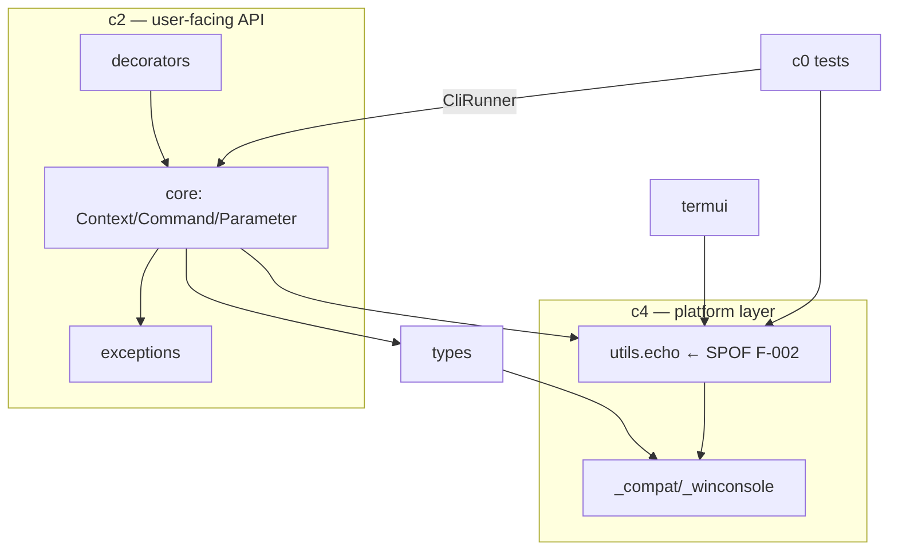
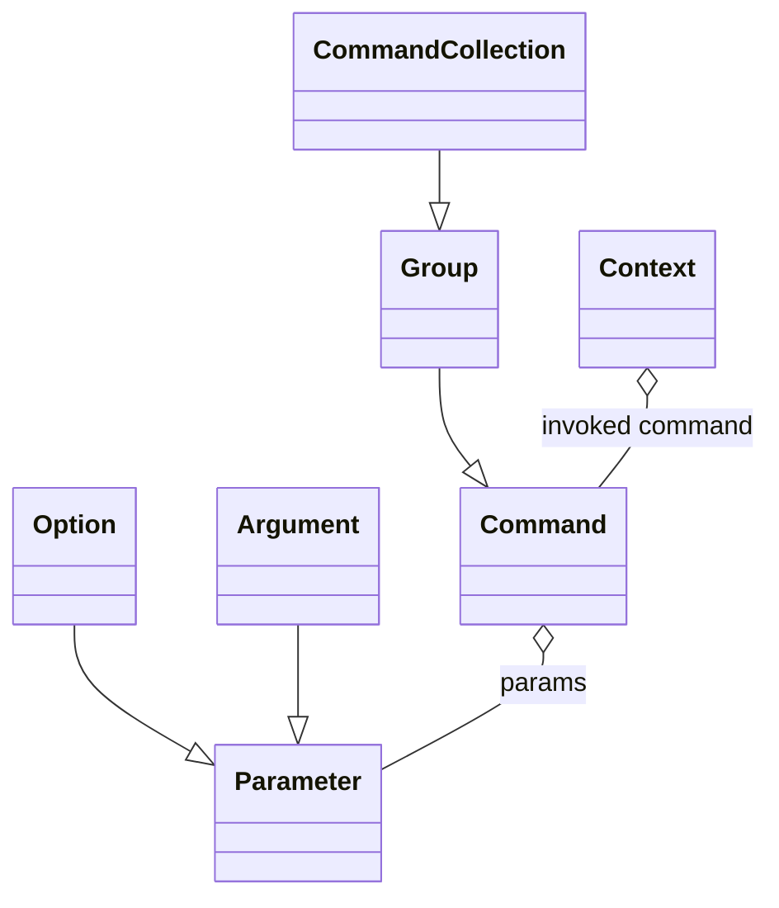

# FINDINGS — pallets/click @ 8a1b1a3 (iteration 0)

Graph: `results/graphs/i00/` (1,226 nodes / 2,070 edges, backend
`ast_extractor/1.00`). Detector output: `results/findings.json` (15
hypotheses). Language rule: every conclusion is qualified to its
evidence class; EXTRACTED facts are stated, INFERRED/AMBIGUOUS claims
are hedged and carry their confidence.

## 1. Macro (graph-level reading)

856 dependency communities exist, but 846 are singletons (docs,
rationale notes, leaf helpers) — the structure lives in ~8 real
clusters:

| Community | Size | Reading (interpretation, INFERRED) |
|---|---|---|
| c0 | 55 | test suite cluster — `tests/*` reaching code almost exclusively through `CliRunner` and `echo` |
| c1 | 43 | terminal implementation: `_termui_impl` + `types` + `_compat` glue |
| c2 | 42 | the user-facing API: `termui`, `core`, `decorators`, `exceptions` |
| c3 | 42 | shell-completion + its tests |
| c4 | 32 | platform-isolation layer: `_compat` (17), `utils` (8), `_winconsole` |

**Who against whom (L07 §10):** a *library* topology — no client/server
split; instead an API façade (`click/__init__`, degree 54) over a core
engine (`core.py`), with a platform layer (`_compat`/`_winconsole`)
quarantining OS differences. Community ≠ folder confirmed: `core`
members appear in both c2 and c3 — the completion concern cuts across
the module boundary (EXTRACTED edges; interpretation INFERRED).

## 2. Meso (community interpretations)

- **c2 (API)** is held together by `imports` + `calls` around
  `Context`/`Command` — a layer, not a domain (INFERRED 0.7).
- **c4 (compat)** is held by `calls` into stream/encoding shims — a
  textbook anti-corruption layer; high cohesion, low outward fan
  (INFERRED 0.7).
- **c0 (tests)** touching code mainly via two doors (`CliRunner`,
  `echo`) suggests the test suite would survive internal refactors that
  preserve those doors (INFERRED 0.6) — directly relevant to fix-loop
  safety.

## 3. Micro — validated findings (5-step inference each)

### F-003 · GOD_NODE · `click.core` — **VALIDATED**

1. **Observation (EXTRACTED):** module degree 18 (fan_out 10) across 4
   communities; 2,689 code lines = 30% of `src/`.
2. **Relation:** `imports`/`calls`, all EXTRACTED 1.0.
3. **Qualified conclusion:** the topology *suggests* a god module
   (confidence 0.8); source validation is required before "defect".
4. **Context:** every command, group, parameter, and context object
   lives here; any change has maximal blast radius.
5. **Source validation (2026-06-12):** `core.py` confirmed to mix ≥4
   concerns: context lifecycle (`Context`, :204), command dispatch
   (`Command` :956, `Group` :1601, `CommandCollection` :2071),
   parameter machinery (`Parameter` :2139, `Option` :2805, `Argument`
   :3545), and presentation helpers (`_format_deprecated_label` :98,
   `_complete_visible_commands` :59, `augment_usage_errors` :120).
   **Status → validated.** Pre-registered hypothesis H1 (TARGET_REPO
   §naive impression) confirmed — by graph first, then source.

### F-002 · SPOF · `click.utils.echo` — **VALIDATED**

1. **Observation (EXTRACTED):** betweenness rank 1; removal disconnects
   49.7% of previously connected pairs in its component.
2. **Relation:** `calls`, EXTRACTED (1.0 / 0.75).
3. **Qualified conclusion:** all terminal output *appears to* flow
   through one 99-line function (confidence 0.75).
4. **Context:** echo decides encoding, color stripping, and stream
   selection globally; a regression here degrades every user-visible
   behavior at once.
5. **Source validation:** `utils.py:245` (~99 lines); direct binding
   from 7 modules (`termui` ×6 call sites, `exceptions`, `core`,
   `decorators`, `shell_completion`, `_termui_impl`) — **no seam or
   indirection exists between callers and the implementation.**
   **Status → validated** — with the explicit caveat that this is a
   deliberate convergence point; the *defect* is the absence of a seam,
   not the convergence itself (careful-language rule).

## 4. Rejected hypotheses (false-positive analysis, T239)

| Finding | Verdict & why |
|---|---|
| F-001 GOD_NODE `click.utils.echo` | **Rejected.** Fan-in 16 vs fan-out 5: a *popular utility*, not a does-everything node; its fan-out is cohesion with the `_compat` IO layer. The healthy-hub counter-check in its own evidence chain decides against it. |
| F-004 GOD_NODE `click` (package) | **Rejected.** `__init__.py` is the documented public-API façade (degree 54 by design). Intentional pattern, not a smell. |
| 9 × TRACE_GAP (`click.INT`, `click.UNPROCESSED`, `Context.params`, …) | **Rejected.** Extractor limitation: module-level constants/attributes are not in the symbol index; all 9 verified to exist in source (e.g. `types.py:1348`). Recorded as known INFERRED-layer precision cost. |
| 2 × TRACE_GAP (`click.palletsprojects.com`) | **Rejected.** URL artifacts in prose, not code claims. |

AMBIGUOUS-evidence audit (T258): no AMBIGUOUS link feeds any validated
finding; all 11 AMBIGUOUS edges were human-triaged above. ✅

## 5. Path reading (T215) — `@click.command` to terminal output

`decorators.command` —calls(EXTRACTED)→ `core.Command` —implements→
`core.Context` (invocation state) —calls→ `types.ParamType.convert`
(value coercion) —calls→ `exceptions.UsageError` (failure path) —calls→
`utils.echo` (all roads end here). Every hop is an EXTRACTED edge in
i00; the chain is the spine of c2 and the reason F-002/F-003 rank top.

## 6. Diagrams (T217–T219)

Claims **not present in click's own docs** (T219): (1) all output
converges on one seam-less function (F-002); (2) `core.py` holds 4
separable concerns and 30% of src (F-003); (3) the test suite couples
to exactly two doors — CliRunner and echo; (4) completion concern cuts
across the core/shell_completion module boundary (c3 membership).

## 7. Fix-loop queue (T241–T242, baselines the diff must move)

| Order | Finding | Scoped fix candidate | Baseline metric |
|---|---|---|---|
| 1 | F-003 core god node | extract presentation helpers (`_format_deprecated_label`/`_format_deprecated_suffix` + usage-error helpers) into a cohesive module | core degree 18; fan_out 10; 2,689 code lines |
| 2 | F-002 echo SPOF | introduce an output-writer seam callers can inject | echo betweenness 0.4965; mandatory ratio 0.497 |

Both validated findings rest on EXTRACTED-only chains → fix-loop
eligible (FR-6.3). KPI T261: **2 validated defects ✅.**

## 8. Live fix-loop campaign (2026-06-12) — honest outcome

Four authorized attempts on the validated findings (gpt-4o fixer,
test-guarded, branch-isolated); full per-iteration evidence in
`results/loop_log.json` and `results/dashboard.md`:

| # | Target | Outcome | Evidence |
|---|---|---|---|
| 1 | F-003 core (mini fixer) | edit broke imports → suite red → **reverted** | loop_log it.1 |
| 2 | F-003 core | structural gain 0.4965→0.4492 (−9.5%) but **70/1,672 tests failed** → reverted | loop_log it.7/12, test tail embedded |
| 3 | F-002 echo seam | model produced no applicable edit blocks twice → **blocked unappliable** | loop_log it.6/9 |
| 4 | exploratory facade extract | tests green, real echo reduction −15.7%, but target was the triage-REJECTED facade + verdict computed on contaminated baseline → **reclassified exploratory**, patch in `results/patches/` | loop_log it.4 annotation |

**Final loop verdict: NO_SAFE_ACTION** — no change met both axes
(behavior green AND structural improvement) on an authorized target.
Per Part-C and T340 this is reported as a first-class result: the
guard worked four times; the codebase's god module resists safe
automated extraction precisely because its concerns are entangled —
which is the finding (F-003) restated by the loop itself.

Integrity incident worth grading attention: attempt 4 was initially
auto-accepted on three measurement defects (stale baseline, finding-id
drift, max-vs-rank-1 score bug) plus one audit defect (no branch
commit). All four were detected by post-hoc verification, fixed with
tests, and the acceptance was reclassified — the full trail is in the
commit history and the loop_log annotation.
