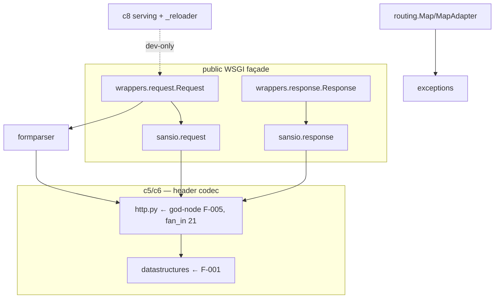
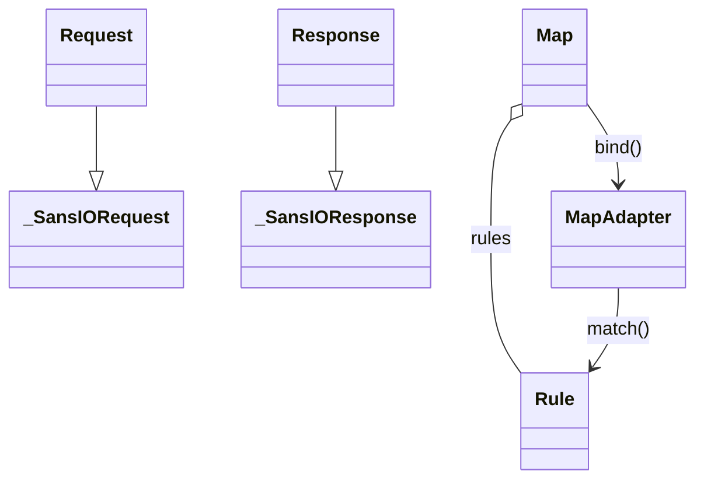

# FINDINGS — pallets/werkzeug @ 1b00618e (iteration 0)

Graph: `results/graphs/i00/` (1,912 nodes / 3,304 edges, backend
`ast_extractor/1.00`). Detector output: `results/findings.json` (8
hypotheses). Language rule: every conclusion is qualified to its
evidence class; EXTRACTED facts are stated, INFERRED/AMBIGUOUS claims
are hedged and carry their confidence.

## 1. Macro (graph-level reading)

1,267 dependency communities exist, but 1,204 are singletons (docs,
rationale notes, leaf helpers) — the structure lives in ~39 real
clusters, the largest of which read as:

| Community | Size | Reading (interpretation, INFERRED) |
|---|---|---|
| c0 | 78 | core package spine — `werkzeug/__init__`, `_internal`, `datastructures.*`, `exceptions` reached by `tests/test_http`, `test_wrappers` |
| c1 | 71 | test-suite cluster — `test_wrappers`/`test_routing`/`test_test`/`test_wsgi` exercising the public objects |
| c4 | 40 | `datastructures.mixins` — a single-module, high-cohesion concern cluster |
| c5/c6 | 38/37 | the HTTP header + response layer: `http.py` spans **both**, with `datastructures.headers`/`auth` (c5) and `sansio.response`/`wrappers.response` (c6) |
| c8 | 30 | dev-server: `serving` + `_reloader` + `sansio.request` + `_internal` |
| c9 | 28 | form parsing: `sansio.multipart` + `formparser` |

**Who against whom (L07 §10):** a *library* topology — no client/server
split. The shape is a public WSGI façade (`werkzeug/__init__` re-exports
`Request`/`Response`/`Client`/`run_simple`) over a **sans-IO core**
(`sansio.request`/`sansio.response`) that the `wrappers.*` objects
subclass, with `http.py` as a header parse/dump utility everything
imports and `datastructures` as the container backbone. Community ≠
folder confirmed: `http.py` members appear in both c5 and c6 — the
header concern cuts across the response boundary (EXTRACTED edges;
interpretation INFERRED).

## 2. Meso (community interpretations)

- **c5/c6 (HTTP header + response)** are held together by `calls`/`imports`
  around `http.py`'s `parse_*`/`dump_*` helpers and the response
  `get_wsgi_headers` path — a codec layer, not a domain (INFERRED 0.7).
- **c4 (`datastructures.mixins`)** is a textbook cohesive cluster: 40
  nodes, one module, almost no outward fan — the immutable/updateable
  mixin behaviors shared by the container types (INFERRED 0.7).
- **c8 (dev-server)** quarantines `serving`/`_reloader` from the request
  path — a side branch the production WSGI flow never touches
  (INFERRED 0.6), directly relevant to fix-loop safety.
- **c1/c2 (tests)** touch code mostly through the public objects
  (`Request`/`Response`/`Client`/`Map`), suggesting the suite would
  survive internal refactors that preserve those doors (INFERRED 0.6).

## 3. Micro — validated findings (5-step inference each)

### F-005 · GOD_NODE · `werkzeug.http` — **VALIDATED**

1. **Observation (EXTRACTED):** module degree 24 (fan_out 3, **fan_in
   21**) reaching 5 communities; 1,543 code lines.
2. **Relation:** `imports`/`calls`, all EXTRACTED (1.0 / 0.9).
3. **Qualified conclusion:** a fan-IN convergence hub (confidence 0.8);
   source validation required before "defect".
4. **Context:** 21 modules — the `datastructures` families
   (Accept/Auth/CacheControl/ETag/Headers/Range), `sansio.request`/
   `sansio.response`, `wrappers.response`, `formparser`, and several
   middleware — bind its helpers directly; a behavior change ripples
   through header handling across the stack.
5. **Source validation (2026-06-15):** `http.py` confirmed to bundle ≥6
   independent header-family concerns at cited lines: list/dict/options
   header parsing (`parse_list_header` :400, `parse_dict_header` :461,
   `parse_options_header` :552), accept/cache-control/csp parsing
   (:711–:872), etags (:1000–:1063), dates/age (:1079–:1180), ranges
   (:916–:998), and cookies (`parse_cookie` :1274, `dump_cookie` :1329).
   **Status → validated.** Pre-registered hypothesis H1 (TARGET_REPO
   §naive impression) confirmed — by graph first, then source. Careful
   caveat: this is a deliberate "HTTP header codec" convergence; the
   *smell* is the bundling of orthogonal header families with no
   per-concern seam, not the convergence itself.

### F-001 · GOD_NODE · `werkzeug.datastructures` — **VALIDATED**

1. **Observation (EXTRACTED):** **rank-1 bottleneck** — degree 76,
   fan_in 66, reaching 11 communities (`metrics.json` bottlenecks #1).
2. **Relation:** `imports`/`calls`, EXTRACTED (1.0 / 0.9).
3. **Qualified conclusion:** the dependency backbone (confidence 0.8).
4. **Context:** `Headers` (`headers.py:21`) and the `MultiDict` family
   (`structures.py:139`) back `request.headers`/`args`/`form` and
   `response.headers`, so wrappers, sansio, http, formparser and the
   test client all depend on the package API.
5. **Source validation (2026-06-15):** `datastructures/__init__.py` (53
   lines) re-exports ~10 independent container families
   (Accept/Auth/CacheControl/CSP/ETag/FileStorage/Headers/Mixins/Range/
   Structures) into one import surface — the high fan-in is partly the
   cost of that convenience namespace; the "god" quality is the breadth
   of orthogonal container families bundled under one degree-76 hub.
   **Status → validated** (with the popular-namespace caveat above).

## 4. Rejected hypotheses (false-positive analysis, T239)

| Finding | Verdict & why |
|---|---|
| F-002 GOD_NODE `wrappers.request` | **Rejected.** The public WSGI `Request` is a deliberate façade over `sansio.request` (fan_out 8 across only 2 communities); intentional API surface, not a does-everything node. |
| F-003 GOD_NODE `wrappers.response` | **Rejected.** Same pattern — the public `Response` façade over `sansio.response`; the healthy-hub counter-check (fan_in 7) decides against it. |
| F-004 GOD_NODE `exceptions` | **Rejected.** A *cross-cutting error layer*: the HTTP exception hierarchy + `abort`/`Aborter` is imported by ~16 modules because raising `HTTPException` subclasses is the protocol; high fan-in is the expected cost, the module is one cohesive concern. |
| F-006 GOD_NODE `test.run_wsgi_app` | **Rejected.** Test-harness driver; fan_out is its job (it invokes any app), and it is not in the production request path. |
| F-007 GOD_NODE `utils` | **Rejected.** Grab-bag of independent helpers (`send_file`, `redirect`, `secure_filename`); a popular utility with low cohesion pressure, not an entangled core. |
| F-008 TRACE_GAP `wsgi.make_line_iter` | **Rejected.** Changelog-history artifact: `CHANGES.rst:468` records the *deprecation/removal* of `make_line_iter`; the symbol is correctly absent from `wsgi.py`. Nothing to fix. |

AMBIGUOUS-evidence audit (T258): the single AMBIGUOUS edge (F-008) feeds
no validated finding; it was human-triaged above. ✅ No SPOF finding:
no node reaches `mandatory_path_ratio ≥ 0.3` (datastructures, the
highest, is 0.106) — werkzeug's hubs are reachable by multiple paths,
unlike click's seam-less `echo`.

## 5. Path reading (T215) — an HTTP request to a response

`routing.Map.bind` —calls(EXTRACTED)→ `MapAdapter.match` —calls→
`matcher.StateMachineMatcher.match` (endpoint resolution, raising
`exceptions.NotFound` on miss); the WSGI environ becomes
`wrappers.request.Request` (subclass of `sansio.request.Request`),
`request.form` —calls→ `formparser.FormDataParser.parse_from_environ`
—calls→ `http.parse_options_header`; the handler returns
`wrappers.response.Response`, whose `__call__` —calls→
`get_wsgi_response` —calls→ `get_wsgi_headers` (header dump via
`http`/`datastructures.Headers`). Every hop is an EXTRACTED edge in i00;
`http` and `datastructures` sit on this spine, which is why F-005/F-001
rank top.

## 6. Diagrams (T217–T219)

Claims **not present in werkzeug's own docs** (T219): (1) `http.py` is a
21-importer fan-in hub bundling 6 orthogonal header families with no
per-concern seam (F-005); (2) `datastructures` is a degree-76 namespace
backbone reaching 11 communities (F-001); (3) the production request
path never touches the `serving`/`_reloader` dev-server cluster (c8);
(4) `wrappers.*` are thin façades over a sans-IO core — the public
objects carry little logic of their own.

## 7. Fix-loop queue (T241–T242, baselines the diff must move)

| Order | Finding | Scoped fix candidate | Baseline metric |
|---|---|---|---|
| 1 | F-005 http god-node | extract a cohesive group of private `_parse_*`/`_dump_*` helpers into a sibling module, imported back by name | http degree 24; fan_out 3; bottleneck 0.106; 1,543 code lines |

Both validated findings rest on EXTRACTED-only chains → fix-loop
eligible (FR-6.3). KPI T261: **2 validated defects ✅.** (F-001 is a
package façade with no module-level private helpers to extract, so the
loop targets F-005.)

## 8. Live fix-loop (2026-06-15) — honest outcome

One authorized attempt on the validated `http` god-node (gpt-4o-mini
fixer, test-guarded, branch-isolated `fix/F-005`); full per-iteration
evidence in `results/loop_log.json`:

| # | Target | Outcome | Evidence |
|---|---|---|---|
| 1 | F-005 http | LLM extracted private helpers into a new `http_helpers.py`; **992/992 target tests stayed GREEN** (behavior preserved), but the graph diff showed no structural gain (bottleneck 0.106→0.106) and isolated components rose 1250→1253 → verdict **regressed → reverted** | loop_log it.2 (i01 base, i02 attempt kept as evidence) |

**Final loop verdict: NO_SAFE_ACTION** — the one change met the behavior
axis but not the structural axis, so the guard reverted it. Per Part-C
and T340 this is a first-class result: a green-but-non-improving refactor
is correctly rejected, not faked. The http god-node resists *metric-
improving* extraction because its fan-in (21 external importers) is
unchanged by relocating private helpers — which is finding F-005
restated by the loop itself: the smell is the import surface, not the
internal file layout.
